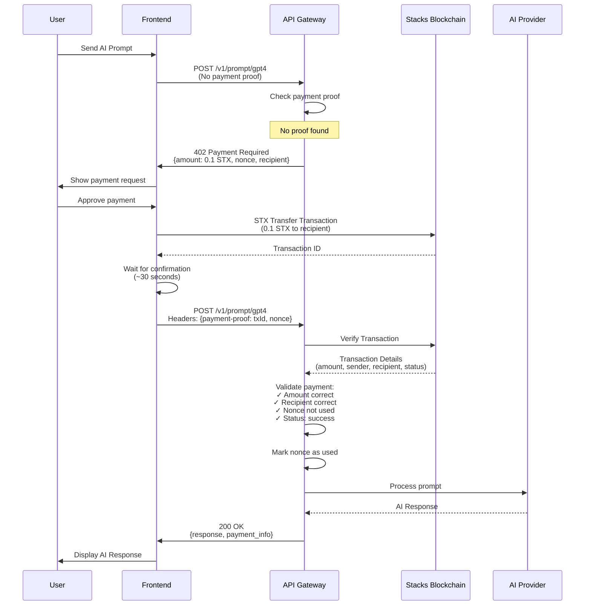
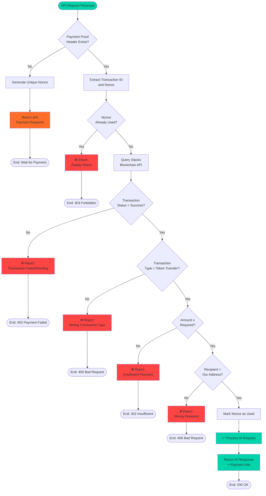

# 🔄 StacksAI Flow Diagrams & Visual Assets

This document contains visual representations of the x402-stacks integration, payment flow, and architecture for use in presentations, videos, and documentation.

---

## 📊 1. x402-Stacks Integration Flow

### Mermaid Diagram (Render in GitHub/Markdown viewers)



### Text-Based Flow (For Screenshots)

```
┌─────────────────────────────────────────────────────────────┐
│                    x402-Stacks Payment Flow                 │
└─────────────────────────────────────────────────────────────┘

1️⃣ USER SENDS PROMPT (No Payment)
   ↓
   User: "Explain blockchain"
   Frontend → API: POST /v1/prompt/gpt4
   
2️⃣ API RETURNS 402 PAYMENT REQUIRED
   ↓
   API → Frontend: {
     status: 402,
     amount: "0.1 STX",
     recipient: "ST1ABC...",
     nonce: "xyz123",
     instructions: "Make STX transfer..."
   }

3️⃣ USER APPROVES PAYMENT
   ↓
   Frontend → Hiro Wallet: Request STX transfer
   User → Wallet: Approve transaction
   Wallet → Stacks: Broadcast transaction
   
4️⃣ BLOCKCHAIN CONFIRMATION
   ↓
   Stacks Blockchain: Transaction confirmed ✓
   Transaction ID: 0x789def...
   Block: #12345
   
5️⃣ RETRY WITH PAYMENT PROOF
   ↓
   Frontend → API: POST /v1/prompt/gpt4
   Headers: {
     X-Payment-Proof: "0x789def...",
     X-Payment-Nonce: "xyz123"
   }

6️⃣ API VERIFIES PAYMENT
   ↓
   API → Stacks API: Get transaction details
   Stacks API → API: {
     status: "success",
     amount: 100000 microSTX,
     recipient: "ST1ABC...",
     sender: "ST2XYZ..."
   }
   
   Validation:
   ✓ Amount matches (0.1 STX)
   ✓ Recipient correct
   ✓ Nonce not used before
   ✓ Transaction confirmed

7️⃣ PROCESS AI REQUEST
   ↓
   API → OpenAI: Process prompt
   OpenAI → API: AI response
   
8️⃣ RETURN RESPONSE
   ↓
   API → Frontend: {
     response: "Blockchain is...",
     payment: {txId, amount, timestamp}
   }
   Frontend → User: Display AI response ✨
```

---

## 🏗️ 2. System Architecture Diagram

### Mermaid Diagram

```mermaid
graph TB
    subgraph "User Layer"
        User[👤 User]
        Wallet[🔐 Hiro Wallet]
    end
    
    subgraph "Frontend Layer"
        NextJS[⚡ Next.js 15<br/>React + TypeScript]
        UI[🎨 TailwindCSS UI]
    end
    
    subgraph "API Gateway Layer"
        Express[🚀 Express.js API]
        X402[🔒 X402 Middleware]
        Router[🧠 AI Router]
    end
    
    subgraph "Blockchain Layer"
        Stacks[⛓️ Stacks Blockchain]
        Bitcoin[₿ Bitcoin<br/>(via PoX)]
    end
    
    subgraph "AI Providers"
        OpenAI[🤖 OpenAI<br/>GPT-4 / GPT-3.5]
        Anthropic[🧠 Anthropic<br/>Claude 3]
    end
    
    subgraph "Storage Layer"
        Redis[(💾 Redis<br/>Nonce Cache)]
    end
    
    User -->|1. Connect| Wallet
    User -->|2. Interact| NextJS
    NextJS --> UI
    NextJS -->|3. API Request| Express
    
    Express --> X402
    X402 -->|4a. No Payment| NextJS
    X402 -->|4b. Verify Payment| Stacks
    
    Wallet -->|5. Sign & Broadcast| Stacks
    Stacks -->|Anchored to| Bitcoin
    
    X402 -->|6. Check Nonce| Redis
    X402 -->|7. Route Request| Router
    
    Router -->|8a. GPT Models| OpenAI
    Router -->|8b. Claude| Anthropic
    
    OpenAI -->|9. Response| Router
    Anthropic -->|9. Response| Router
    
    Router -->|10. Return| Express
    Express -->|11. Final Response| NextJS
    NextJS -->|12. Display| User
    
    style User fill:#FF6D29
    style Stacks fill:#5546FF
    style Bitcoin fill:#F7931A
    style X402 fill:#00D4AA
```

### Component Breakdown

```
┌─────────────────────────────────────────────────────────────┐
│                    STACKSAI ARCHITECTURE                    │
└─────────────────────────────────────────────────────────────┘

📱 FRONTEND (Next.js 15)
├── Landing Page (Marketing)
├── Chat Interface (AI Playground)
├── Wallet Integration (Hiro Wallet)
└── Payment Flow Handler
    ├── Detect 402 Response
    ├── Initiate STX Transfer
    ├── Wait for Confirmation
    └── Retry with Proof

🔌 API GATEWAY (Express.js)
├── X402 Middleware
│   ├── Payment Requirement Check
│   ├── Nonce Generation
│   ├── Payment Verification
│   └── Replay Attack Prevention
├── AI Router Service
│   ├── Model Selection (GPT-4/Claude/GPT-3.5)
│   ├── Request Forwarding
│   └── Response Handling
└── Routes
    ├── /health - Health check
    ├── /v1/prompt/:model - AI requests
    └── /stats - Usage statistics

⛓️ BLOCKCHAIN (Stacks)
├── STX Token Transfers
├── Transaction Verification
├── Block Confirmation
└── Bitcoin Anchoring (PoX)

🤖 AI PROVIDERS
├── OpenAI API (GPT-4, GPT-3.5)
└── Anthropic API (Claude 3)

💾 STORAGE
└── Redis (Nonce Management)
    ├── Generate unique nonces
    ├── Track used nonces
    └── Prevent replay attacks
```

---

## 💰 3. Payment Verification Flow

### Mermaid Diagram



### Verification Checklist

```
┌─────────────────────────────────────────────────────────────┐
│              PAYMENT VERIFICATION CHECKLIST                 │
└─────────────────────────────────────────────────────────────┘

Step 1: Extract Payment Proof
  ├─ Header: X-Payment-Proof (Transaction ID)
  └─ Header: X-Payment-Nonce (Unique ID)

Step 2: Nonce Validation
  ├─ ✓ Nonce exists in request
  ├─ ✓ Nonce format is valid
  ├─ ✓ Nonce not expired (< 5 minutes old)
  └─ ✓ Nonce not used before (check Redis)

Step 3: Blockchain Query
  ├─ Query: GET /extended/v1/tx/{txId}
  ├─ API: Stacks Blockchain API
  └─ Response: Transaction details

Step 4: Transaction Validation
  ├─ ✓ tx_status = "success"
  ├─ ✓ tx_type = "token_transfer"
  ├─ ✓ token_transfer.amount ≥ required_amount
  ├─ ✓ token_transfer.recipient = our_address
  └─ ✓ burn_block_time < 1 hour ago

Step 5: Security Checks
  ├─ ✓ Mark nonce as used (prevent replay)
  ├─ ✓ Log transaction for audit trail
  └─ ✓ Attach payment info to request

Step 6: Process Request
  ├─ ✓ Forward to AI provider
  ├─ ✓ Get AI response
  └─ ✓ Return with payment metadata

✅ ALL CHECKS PASSED → Process AI Request
❌ ANY CHECK FAILED → Reject with specific error
```

---

## 🎯 4. Stacks Blockchain Benefits

### Visual Comparison

```
┌─────────────────────────────────────────────────────────────┐
│          WHY STACKS FOR DECENTRALIZED AI ACCESS?            │
└─────────────────────────────────────────────────────────────┘

🔒 SECURITY
├─ Bitcoin-Anchored
│  └─ Every Stacks block is anchored to Bitcoin
│     → Inherits Bitcoin's security
│     → 100% of Bitcoin's hash power protects Stacks
│
├─ Proof of Transfer (PoX)
│  └─ Miners commit BTC to mine STX
│     → Economic alignment with Bitcoin
│     → No new consensus mechanism to attack
│
└─ Immutable Transactions
   └─ Once confirmed, payments cannot be reversed
      → No chargebacks
      → Transparent audit trail

💡 SMART CONTRACTS
├─ Clarity Language
│  └─ Decidable, non-Turing complete
│     → No infinite loops
│     → Predictable gas costs
│
├─ Bitcoin Compatibility
│  └─ Read Bitcoin state in Stacks contracts
│     → Unlock Bitcoin's $1T+ value
│     → Build on Bitcoin without forks
│
└─ Token Standards
   └─ SIP-010 Fungible Tokens (STX)
      → Easy integration
      → Wallet support (Hiro, Xverse)

⚡ PERFORMANCE
├─ Fast Finality
│  └─ ~10-30 seconds for confirmation
│     → Faster than Bitcoin (10 min)
│     → Good UX for micropayments
│
├─ Low Fees
│  └─ Typical transaction: < $0.01
│     → Enables micropayments
│     → Cost-effective for small AI requests
│
└─ Scalability
   └─ Subnets and Layer 2 solutions
      → Future-proof architecture
      → Can handle high throughput

🌍 ACCESSIBILITY
├─ Global Access
│  └─ No credit card required
│     → Accessible to 1.7B unbanked people
│     → Only need internet + wallet
│
├─ Pseudonymous
│  └─ No KYC for basic usage
│     → Privacy-preserving
│     → Permissionless access
│
└─ Open Ecosystem
   └─ Open source tools and SDKs
      → Stacks.js for JavaScript
      → Hiro Wallet for users
      → Active developer community

🔧 DEVELOPER EXPERIENCE
├─ Excellent Tooling
│  ├─ Stacks.js SDK
│  ├─ Hiro Wallet API
│  ├─ Blockchain API
│  └─ Testnet with faucet
│
├─ Documentation
│  └─ Comprehensive guides
│     → Easy to get started
│     → Active community support
│
└─ Integration
   └─ Works with existing web stack
      → No blockchain-specific backend
      → Standard HTTP APIs
```

### Comparison Table

```
┌─────────────────────────────────────────────────────────────┐
│        STACKS VS OTHER BLOCKCHAIN PLATFORMS                 │
└─────────────────────────────────────────────────────────────┘

Feature          │ Stacks    │ Ethereum  │ Solana    │ Bitcoin
─────────────────┼───────────┼───────────┼───────────┼─────────
Security         │ ⭐⭐⭐⭐⭐ │ ⭐⭐⭐⭐   │ ⭐⭐⭐     │ ⭐⭐⭐⭐⭐
(Bitcoin-backed) │           │           │           │
─────────────────┼───────────┼───────────┼───────────┼─────────
Smart Contracts  │ ⭐⭐⭐⭐⭐ │ ⭐⭐⭐⭐⭐ │ ⭐⭐⭐⭐⭐ │ ❌
─────────────────┼───────────┼───────────┼───────────┼─────────
Transaction Cost │ < $0.01   │ $1-50     │ < $0.01   │ $1-5
─────────────────┼───────────┼───────────┼───────────┼─────────
Confirmation     │ 30 sec    │ 15 sec    │ 0.4 sec   │ 10 min
Time             │           │           │           │
─────────────────┼───────────┼───────────┼───────────┼─────────
Micropayments    │ ✅        │ ❌        │ ✅        │ ⚠️
Friendly         │           │ (high gas)│           │ (slow)
─────────────────┼───────────┼───────────┼───────────┼─────────
Bitcoin          │ ✅        │ ❌        │ ❌        │ ✅
Integration      │ (native)  │           │           │ (native)
─────────────────┼───────────┼───────────┼───────────┼─────────
Developer Tools  │ ⭐⭐⭐⭐   │ ⭐⭐⭐⭐⭐ │ ⭐⭐⭐⭐   │ ⭐⭐⭐
─────────────────┼───────────┼───────────┼───────────┼─────────
Best For         │ Bitcoin   │ DeFi      │ High      │ Store
                 │ DApps     │ Complex   │ Throughput│ of Value
                 │           │ Contracts │           │

✅ Stacks = Best of both worlds (Bitcoin security + Smart contracts)
```

---

## 📈 5. Value Proposition Infographic

```
┌─────────────────────────────────────────────────────────────┐
│              STACKSAI VALUE PROPOSITION                     │
└─────────────────────────────────────────────────────────────┘

🎯 FOR USERS
┌──────────────────────────────────────┐
│ Traditional AI Services              │
├──────────────────────────────────────┤
│ ❌ $20-200/month subscription        │
│ ❌ Pay even if you don't use         │
│ ❌ Credit card required              │
│ ❌ Centralized payment processor     │
│ ❌ No payment transparency           │
└──────────────────────────────────────┘

                  ⬇️  STACKSAI  ⬇️

┌──────────────────────────────────────┐
│ StacksAI on Stacks Blockchain        │
├──────────────────────────────────────┤
│ ✅ $0.04-0.12 per prompt             │
│ ✅ Pay only for what you use         │
│ ✅ Only crypto wallet needed         │
│ ✅ Decentralized, trustless          │
│ ✅ Every payment on-chain            │
└──────────────────────────────────────┘

💰 COST COMPARISON
┌─────────────────────────────────────────────┐
│ Usage Pattern: 10 prompts/month             │
├─────────────────────────────────────────────┤
│ ChatGPT Plus:     $20.00/month              │
│ Claude Pro:       $20.00/month              │
│ StacksAI (GPT-4): $1.00/month (10 × $0.10) │
│                                             │
│ 💰 SAVINGS: $19/month (95% cheaper!)       │
└─────────────────────────────────────────────┘

🌍 FOR THE STACKS ECOSYSTEM
┌──────────────────────────────────────┐
│ Real-World Utility                   │
├──────────────────────────────────────┤
│ ✅ Practical use case beyond DeFi    │
│ ✅ Drives STX token demand           │
│ ✅ Onboards AI users to Stacks       │
│ ✅ Showcases Bitcoin-secured apps    │
│ ✅ Demonstrates x402 protocol        │
│ ✅ Open source reference impl.       │
└──────────────────────────────────────┘

🔧 FOR DEVELOPERS
┌──────────────────────────────────────┐
│ x402-Stacks Integration              │
├──────────────────────────────────────┤
│ ✅ HTTP 402 standard implementation  │
│ ✅ Blockchain payment verification   │
│ ✅ Replay attack prevention          │
│ ✅ Reusable middleware pattern       │
│ ✅ Complete documentation            │
│ ✅ Production-ready code             │
└──────────────────────────────────────┘
```

---

## 🎨 How to Use These Diagrams

### For Video
1. **Screenshot the text-based flows** - easier to read on screen
2. **Render Mermaid diagrams** using:
   - GitHub (paste in .md file)
   - Mermaid Live Editor (mermaid.live)
   - VS Code Mermaid extension
3. **Animate the sequence diagram** - show steps one by one
4. **Use comparison tables** as slides

### For Presentations
1. **Export Mermaid as PNG/SVG**
2. **Create slides** from each section
3. **Add your branding** (colors, logo)
4. **Highlight key points** with arrows/circles

### For Documentation
1. **Embed in README.md** - Mermaid renders on GitHub
2. **Link to this file** from main docs
3. **Use in integration guide**
4. **Include in video description**

---

## 🎬 Recommended Video Sequence

1. **Show Architecture Diagram** (30 sec)
   - Explain components
   - Highlight x402 middleware

2. **Walk Through Payment Flow** (60 sec)
   - Use sequence diagram
   - Pause at each step
   - Show actual code snippets

3. **Show Verification Flowchart** (30 sec)
   - Explain security checks
   - Highlight replay prevention

4. **Present Stacks Benefits** (30 sec)
   - Use comparison table
   - Emphasize Bitcoin security

5. **Show Value Proposition** (20 sec)
   - Cost comparison
   - Ecosystem benefits

**Total**: ~3 minutes of technical content

---

## 📝 Notes

- All Mermaid diagrams can be rendered in GitHub markdown
- Text-based diagrams work in any text editor
- Export diagrams as images for presentations
- Use consistent colors: Orange (#FF6D29) for StacksAI, Purple (#5546FF) for Stacks
- Keep diagrams simple and focused
- Add annotations for clarity

---

**Generated for**: StacksAI Hackathon Submission
**Last Updated**: February 10, 2026
**License**: MIT (same as project)
