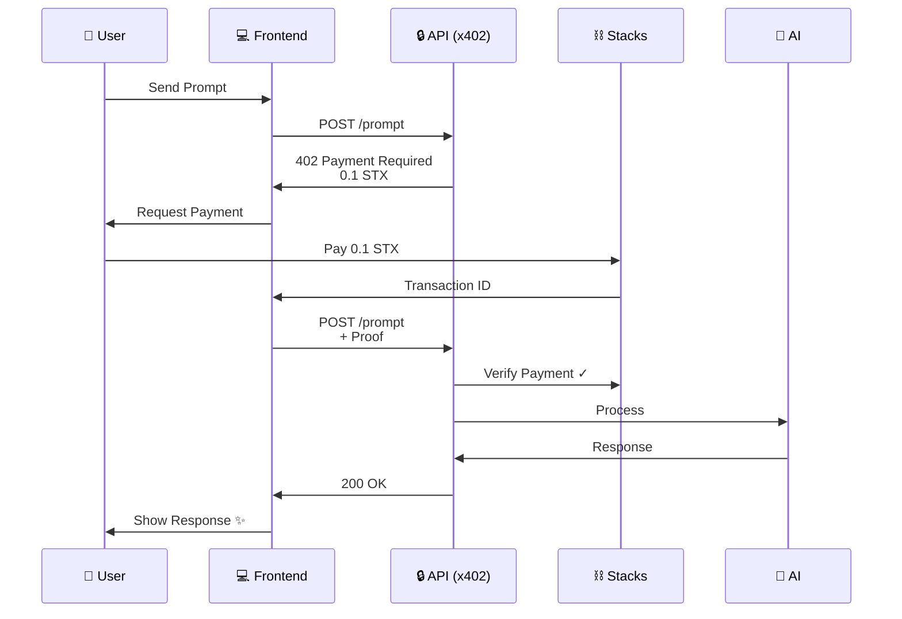
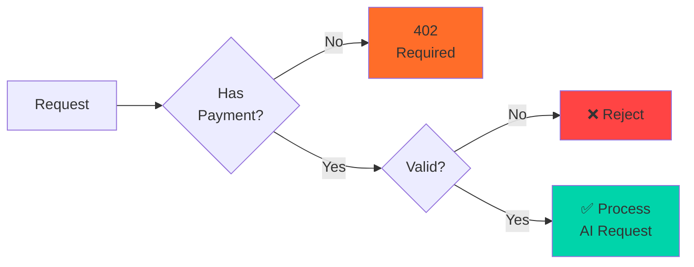
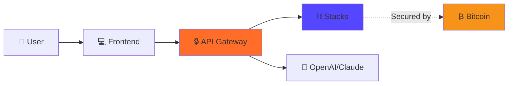

# 🎬 Simplified Diagrams for Video (Easy to Read on Screen)

These are condensed, high-contrast versions optimized for video display.

---

## 1️⃣ x402 Payment Flow (Simplified)

### Mermaid - Compact Version



### Text Version - Ultra Simple

```
┌─────────────────────────────────────────────┐
│         x402 PAYMENT FLOW (5 STEPS)         │
└─────────────────────────────────────────────┘

1️⃣  USER SENDS PROMPT
    "Explain blockchain"
    ↓
    
2️⃣  API RETURNS 402
    "Payment Required: 0.1 STX"
    ↓
    
3️⃣  USER PAYS WITH WALLET
    Hiro Wallet → Stacks Blockchain
    ↓
    
4️⃣  API VERIFIES PAYMENT
    ✓ Amount correct
    ✓ Transaction confirmed
    ↓
    
5️⃣  AI RESPONSE DELIVERED
    "Blockchain is a distributed ledger..."
```

---

## 2️⃣ Payment Verification (Simplified)

### Flowchart - Compact



### Checklist - Simple

```
┌──────────────────────────────────┐
│   PAYMENT VERIFICATION STEPS     │
└──────────────────────────────────┘

✓ Check payment proof exists
✓ Verify nonce not used
✓ Query Stacks blockchain
✓ Confirm transaction success
✓ Validate amount ≥ required
✓ Check recipient address
✓ Mark nonce as used
✓ Process AI request
```

---

## 3️⃣ System Architecture (Simplified)

### Component Diagram - Minimal



### 3-Layer Stack

```
┌─────────────────────────────────┐
│      STACKSAI ARCHITECTURE      │
└─────────────────────────────────┘

📱 FRONTEND
   Next.js + Hiro Wallet
          ↓
🔒 API GATEWAY
   x402 Middleware
          ↓
⛓️  BLOCKCHAIN
   Stacks → Bitcoin
          ↓
🤖 AI PROVIDERS
   GPT-4 / Claude
```

---

## 4️⃣ Stacks Benefits (Video Slide)

```
┌─────────────────────────────────────────┐
│      WHY STACKS BLOCKCHAIN?             │
└─────────────────────────────────────────┘

🔒 BITCOIN SECURITY
   Every transaction anchored to Bitcoin
   
💡 SMART CONTRACTS
   Clarity language + Token transfers
   
⚡ FAST & CHEAP
   30 sec confirmation, < $0.01 fees
   
🌍 GLOBAL ACCESS
   No credit card needed
```

---

## 5️⃣ Cost Comparison (Video Slide)

```
┌─────────────────────────────────────────┐
│         COST COMPARISON                 │
│    (10 AI Prompts per Month)            │
└─────────────────────────────────────────┘

ChatGPT Plus:  $20.00/month
Claude Pro:    $20.00/month

StacksAI:      $1.00/month
               ↑
          💰 95% CHEAPER!
```

---

## 6️⃣ Key Features (Video Slide)

```
┌─────────────────────────────────────────┐
│         STACKSAI FEATURES               │
└─────────────────────────────────────────┘

✅ Pay-per-prompt pricing
✅ HTTP 402 protocol
✅ Blockchain verification
✅ Replay attack prevention
✅ Multi-model support
✅ Open source
```

---

## 🎬 How to Use in Video

### Timing Suggestions

**Intro (30s)**
- Show: Cost Comparison slide
- Show: Key Features slide

**Demo (2-3 min)**
- Show: x402 Payment Flow (text version)
- Overlay on screen during demo
- Highlight each step as you do it

**Technical (1-2 min)**
- Show: System Architecture diagram
- Show: Payment Verification checklist
- Show: Stacks Benefits slide

**Conclusion (30s)**
- Show: Cost Comparison again
- Show: GitHub link

### Display Tips

1. **Use Large Font** - Minimum 24pt for text
2. **High Contrast** - White text on dark background
3. **One Concept Per Screen** - Don't overcrowd
4. **Pause on Diagrams** - Give viewers time to read
5. **Highlight Current Step** - Use arrows or circles

### Screen Layout

```
┌─────────────────────────────────────────┐
│                                         │
│   [Your Demo/Code Here]                 │
│                                         │
│                                         │
├─────────────────────────────────────────┤
│  ┌───────────────────────────────────┐  │
│  │  [Diagram/Flow Here]              │  │ ← Bottom 1/3
│  │  Current Step: 3/5                │  │
│  └───────────────────────────────────┘  │
└─────────────────────────────────────────┘
```

---

## 📐 Export Settings

### For Video Overlay

**Mermaid Diagrams:**
- Export as PNG with transparent background
- Resolution: 1920x1080 or higher
- Use dark theme for better contrast

**Text Diagrams:**
- Screenshot with high DPI
- Or use monospace font overlay
- White text on semi-transparent dark background

### Recommended Tools

1. **Mermaid Live Editor** (mermaid.live)
   - Paste code
   - Export as PNG/SVG
   - Choose dark theme

2. **OBS Studio Overlays**
   - Add text source
   - Use monospace font (Consolas, Monaco)
   - Add semi-transparent background

3. **Video Editor**
   - Import PNG diagrams
   - Add as overlay
   - Fade in/out between steps

---

## 🎨 Color Scheme for Video

```
StacksAI Orange:  #FF6D29
Stacks Purple:    #5546FF
Bitcoin Orange:   #F7931A
Success Green:    #00D4AA
Error Red:        #FF4444
Background:       #000000 or #1A1A1A
Text:             #FFFFFF
```

---

## 📝 Quick Reference

### Most Important Diagrams for Video

1. **x402 Payment Flow (Text)** - Show during demo
2. **System Architecture** - Show in technical section
3. **Cost Comparison** - Show in intro & conclusion
4. **Stacks Benefits** - Show in technical section

### Timing Per Diagram

- x402 Flow: 60 seconds (walk through each step)
- Architecture: 30 seconds (quick overview)
- Cost Comparison: 15 seconds (powerful visual)
- Stacks Benefits: 30 seconds (explain each point)

---

**Pro Tip**: Keep diagrams on screen for at least 5 seconds - viewers need time to read and understand!

**Generated for**: StacksAI Video Demo
**Optimized for**: 1080p Video Display
**Last Updated**: February 10, 2026
